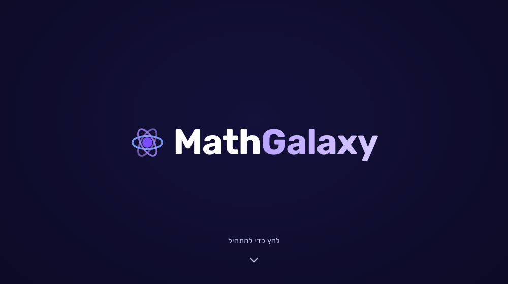
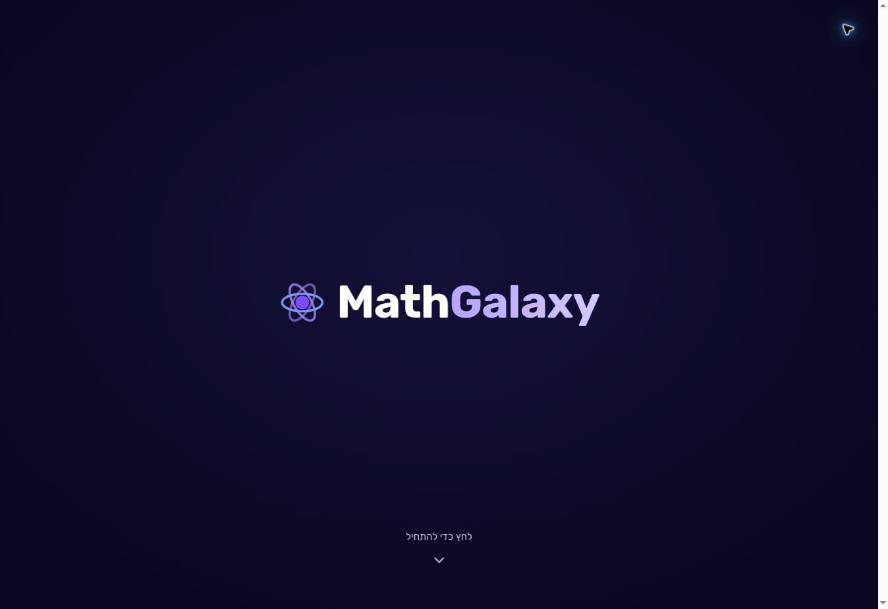
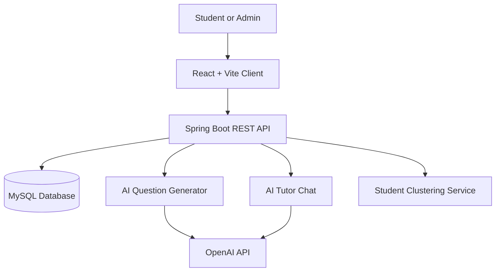

<div align="center">
  

# MathGalaxy

### Adaptive Mathematics Learning Platform

A full-stack educational platform that personalizes mathematics practice, combines rule-based and AI-generated questions, and turns student progress into an engaging, multilingual learning experience.

[](https://react.dev/)
[](https://spring.io/projects/spring-boot)
[](https://www.mysql.com/)
[](https://fastapi.tiangolo.com/)
[](https://www.docker.com/)

[Live Application](https://app.adaptivemathplatform.dev/login) · [Repository](https://github.com/batya15777/adaptive-math-platform)

> **Deployment status:** The application was deployed and operational. Services that depend on the Railway database are temporarily unavailable because the hosting subscription is currently paused.

</div>

---

## Product Overview

MathGalaxy was built to make mathematics practice adaptive rather than static. The platform follows each student's progress, generates questions at an appropriate level, identifies learning patterns, and provides guided support through an AI tutor.

The experience is wrapped in a space-themed, gamified interface designed to encourage consistent practice without losing sight of the educational goal.

## Highlights

- **Adaptive practice** — question difficulty changes according to student performance and progress.
- **Dynamic question generation** — combines code-based generation with an AI-powered generator and a reliable fallback flow.
- **AI tutor chat** — gives progressive guidance and hints without immediately revealing the answer.
- **Student dashboard** — presents progress, recommendations, streaks, achievements, stars, and leaderboard data.
- **Daily practice and games** — encourages short, consistent learning sessions through rewards and interactive challenges.
- **Admin workspace** — supports curriculum management, analytics, student insights, and clustering operations.
- **Personalization and accessibility** — includes avatar selection, profile settings, themes, and accessibility options.
- **Multilingual interface** — Hebrew, English, and Russian with RTL/LTR support.
- **Secure account flow** — registration, login, email verification with OTP, and HttpOnly cookie-based sessions.

## Product Preview



<p align="center"><strong>Space-themed, multilingual learning experience</strong></p>

The product includes a personalized student home, adaptive practice, progress analytics, an AI tutor, educational games, profile and accessibility settings, leaderboards, and an administration workspace.

> A complete walkthrough featuring the student, game, settings, and admin experiences will be added when the temporarily paused live services are restored. This README intentionally avoids presenting authentication mockups as product screens.

## Architecture



The Java backend is the central application layer. It manages users, learning flows, progress, administration, and persistence while coordinating three focused Python/FastAPI services:

- **AI Questions Generator** — generates themed mathematics questions.
- **AI Tutor Chat** — provides guided, conversational support.
- **Student Clustering Service** — uses K-Means to identify learning groups from student data.

## Technology Stack

| Layer | Technologies |
|---|---|
| Frontend | React 19, Vite, React Router, Axios, Framer Motion, Recharts |
| Backend | Java 17, Spring Boot, Spring Data JPA, Hibernate, HikariCP |
| Database | MySQL |
| AI services | Python, FastAPI, OpenAI API |
| Machine learning | K-Means student clustering |
| Authentication | Email OTP verification, HttpOnly cookie sessions |
| Infrastructure | Docker, Render, Railway, Resend |
| Internationalization | Hebrew, English, Russian, RTL/LTR layouts |

## My Contribution — Batya Tayeb

MathGalaxy was developed collaboratively by a team of three. I was a full project partner and contributed across the product, frontend, backend integration, and administration experience.

My main areas of ownership were:

- Built the **registration and login experience**, including the email OTP verification flow.
- Developed the **student chat experience** for communicating with the AI tutor.
- Built the **profile and settings area**, including accessibility features and avatar selection.
- Developed the **educational game experience**.
- Integrated **daily practice** with learning functionality created elsewhere in the team.
- Planned and shaped the platform's **visual design and user experience**.
- Implemented the majority of the **admin experience and supporting functionality**.
- Contributed to integration and refinement across the complete application.

The machine-learning clustering component was implemented by another team member. This project reflects genuine collaborative development, with shared responsibility for integration and delivery.

## Repository Structure

```text
adaptive-math-platform/
├── client/                                  # React + Vite application
├── server/                                  # Java + Spring Boot backend
├── microservices/
│   ├── AI_Questions_Generator/              # Dynamic question service
│   ├── AI_Tutor_Chat/                       # Guided tutoring service
│   └── student-clustering-service/          # K-Means clustering service
├── docs/design/                             # Design specifications and mockups
└── render.yaml                              # Cloud deployment configuration
```

## Local Development

### Prerequisites

- Java 17+
- Node.js 18+ and npm
- Python 3.10+ and `uv`
- MySQL
- OpenAI API key for AI-powered features

### 1. Create the database

```sql
CREATE DATABASE adaptive_db
  CHARACTER SET utf8mb4
  COLLATE utf8mb4_unicode_ci;
```

Set the database configuration through environment variables:

```bash
export DB_HOST=localhost
export DB_PORT=3306
export DB_SCHEMA=adaptive_db
export DB_USERNAME=your_username
export DB_PASSWORD=your_password
```

### 2. Start the backend

```bash
cd server
./mvnw spring-boot:run
```

The backend runs on `http://localhost:8080`.

### 3. Start the frontend

```bash
cd client
npm install
npm run dev
```

The client runs on `http://localhost:5173`.

### 4. Start the microservices

Configure the AI services first:

```bash
export OPENAI_API_KEY=your_openai_api_key
export OPENAI_MODEL=gpt-4o-mini
```

Then run each service in a separate terminal:

```bash
cd microservices/AI_Questions_Generator
uv sync
uv run uvicorn main:app --reload --port 8000
```

```bash
cd microservices/AI_Tutor_Chat
uv sync
uv run uvicorn main:app --reload --port 8001
```

```bash
cd microservices/student-clustering-service
uv sync
uv run uvicorn main:app --reload --port 8002
```

## Quality Checks

```bash
# Backend tests
cd server
./mvnw test

# Frontend tests and linting
cd client
npm test
npm run lint
npm run build
```

## Deployment

The production architecture uses:

- **Render** for the React client, Spring Boot backend, and microservices.
- **Railway** for the managed MySQL database.
- **Resend** for verification emails.
- **Docker** for reproducible service builds.
- A custom domain at [adaptivemathplatform.dev](https://app.adaptivemathplatform.dev/login).

---

<div align="center">
  <strong>Built as a three-person Computer Science project combining full-stack engineering, AI services, machine learning, and educational product design.</strong>
</div>
